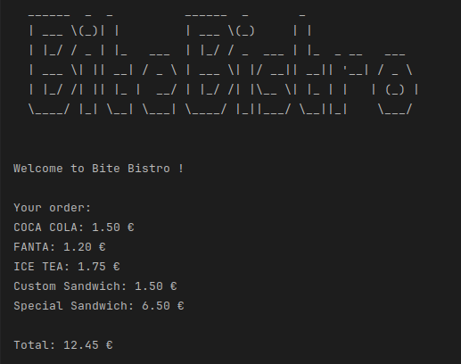
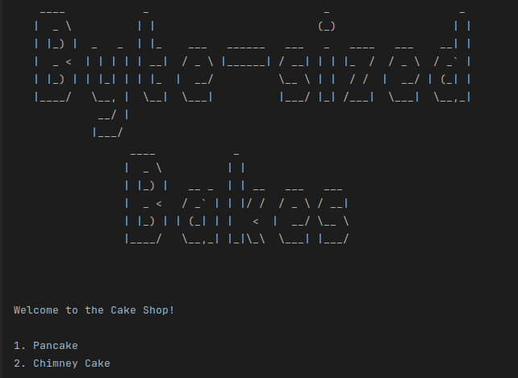
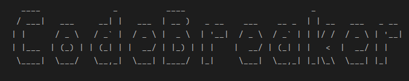
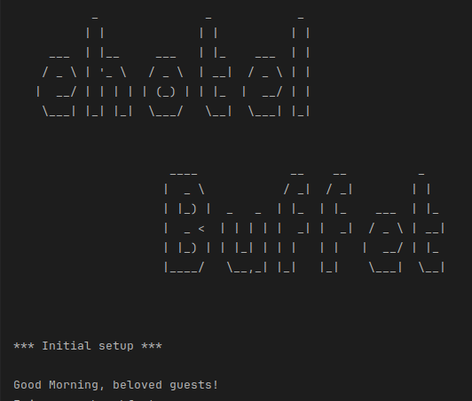
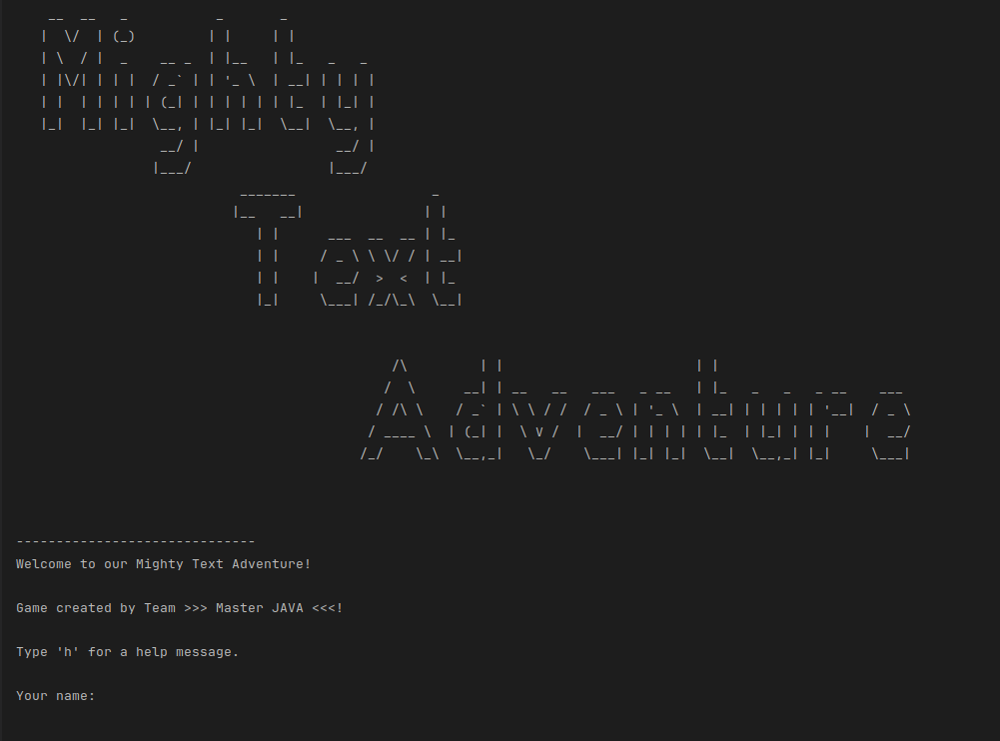
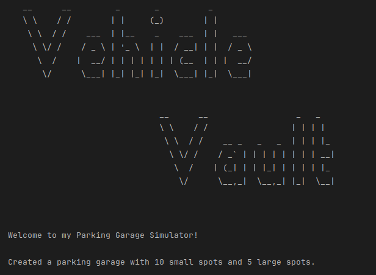

## basicJava

<table style="width:100%; table-layout:fixed;">
  <tr>
    <th style="text-align:center;">Project Name</th>
    <th style="text-align:center;">Image</th>
    <th style="text-align:center;">Repo</th>
    <th style="text-align:center;">Demo</th>
  </tr>
  
  <tr>
    <td style="text-align:center;"><strong>Bite Bistro</strong></td>
    <td style="text-align:center;"></td>
    <td style="text-align:center;"></td>
    <td style="text-align:center;"></td>
  </tr>

  <tr>
    <td style="text-align:center;"><strong>Byte Sized Bakes</strong></td>
    <td style="text-align:center;"></td>
    <td style="text-align:center;"></td>
    <td style="text-align:center;"></td>
  </tr>

  <tr>
    <td style="text-align:center;"><strong>Code Breaker</strong></td>
    <td style="text-align:center;"></td>
    <td style="text-align:center;"></td>
    <td style="text-align:center;"></td>
  </tr>

  <tr>
    <td style="text-align:center;"><strong>E-Hotel Buffet</strong></td>
    <td style="text-align:center;"></td>
    <td style="text-align:center;"></td>
    <td style="text-align:center;"></td>
  </tr>

  <tr>
    <td style="text-align:center;"><strong>Mighty Text Adventure</strong></td>
    <td style="text-align:center;"></td>
    <td style="text-align:center;"></td>
    <td style="text-align:center;"></td>
  </tr>

  <tr>
    <td style="text-align:center;"><strong>Post Master</strong></td>
    <td style="text-align:center;"></td>
    <td style="text-align:center;"></td>
    <td style="text-align:center;"></td>
  </tr>

  <tr>
    <td style="text-align:center;"><strong>Vehicle Vault</strong></td>
    <td style="text-align:center;"></td>
    <td style="text-align:center;"></td>
    <td style="text-align:center;"></td>
  </tr>
</table>
